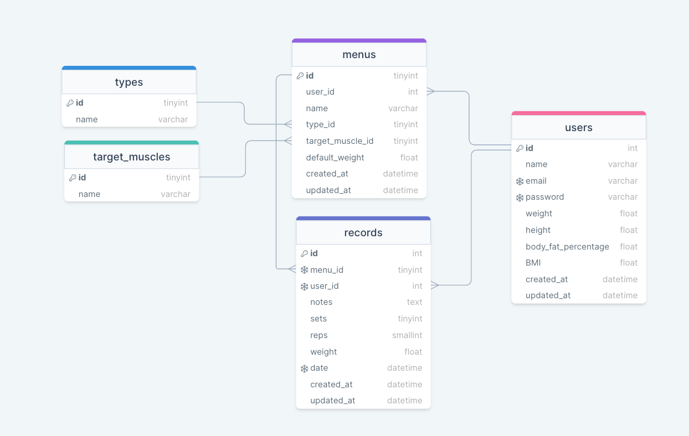

# 筋トレ管理アプリ

## デプロイ環境

### 公開したアプリの URL

### CI/CD

GitHub actions

# 開発環境

## 開発言語

ruby

## フレームワーク

## ER 図

## 動作対象端末・OS

## 動作対象 OS

## 開発期間

# アプリケーション機能

## 検討中機能一覧

- ログイン機能　 OAuth0

### 登録系
- トレーニングメニュー追加
    - トレーニング名
    - 部位
    - 種類
        - 自重・マシン・フリー
    - デフォルト重量
- 筋トレメニュー記録

### 表示系

- その日取り組んだメニュー画面
    - 重さ
    - セット数
    - メモ
- 今月取り組んだメニュー画面
- それぞれのグラフ

### 編集系

- 登録トレーニングメニュー編集
- その日に取り組んだメニュー編集

### 削除系

- トレーニング削除
- その日に取り組んだメニュー削除

## 使用している API,SDK,ライブラリなど

## 使用方法
